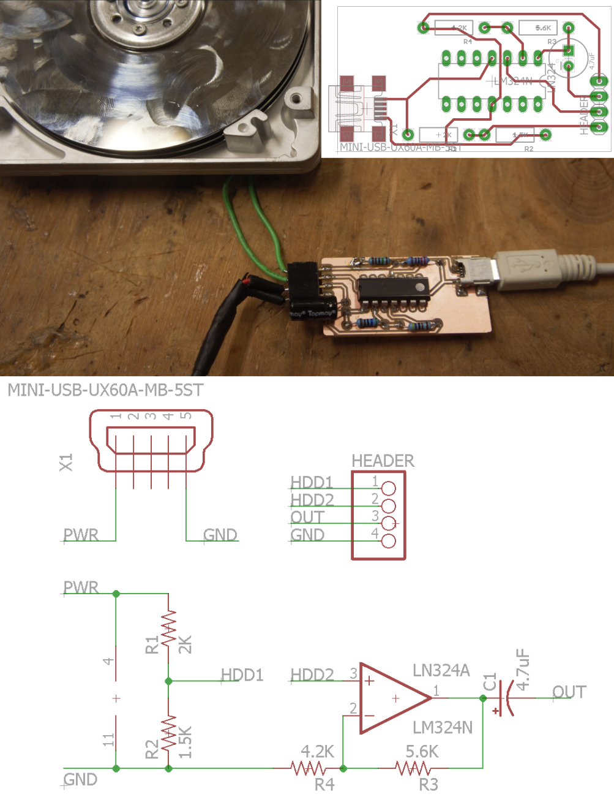

ewasteorchestra
===============

A group of schematics and code for building instruments out of ewaste

<h3>USB powered Hard Drive Amplifier</h3>

<h3>Harddrive Guitar using Arduino, Firmata, and Pd-Extended</h3>

 Works with the latest Firmata as of 4/20/2016 as distributed with Arduino 1.6.8. Sound synthesis by <a href="http://puredata.info/downloads/pd-extended">pd-extended version 0.43.4</a>, which is apparently deprecated but I'll have to catch up another time.

 The arduino object (a.k.a. <a href="http://puredata.info/downloads/pduino">pduino</a>) by <a href="http://www.at.or.at/hans/pd/objects.html">Hans-Christoph Steiner</a> is distributed in the same folder as harddrivepackage.pd for out of the box functionality. 

 The pd sketch takes the analog inputs of the arduino (which should have SimpleAnalogFirmata flashed to memory via the Arduino IDE) and controls the volume of six oscillator objects. The MIDI value of those oscillator objects are triggered by a USB numpad. Being that the output of the DC motors in the harddrives are AC sinewaves, and the Arduino's ADC is only positive voltage at a certain sample rate, the program sums recent samples from each input while also constantly substracting from that sum over time, so the effect is that the faster you spin the hard disk, the faster you reach max volume. As soon as the harddrive stops spinning, the sum is quickly decremented to 0.  This happens in the fade subpatch of the chordfader subpatch. It's quite ugly and I wrote it before I knew about the line~ function so its not perfect. 

